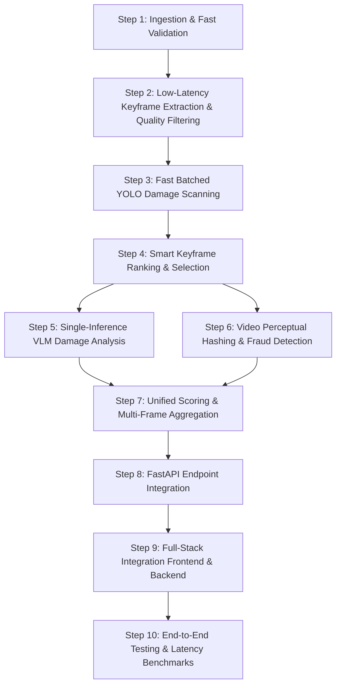

# 🎥 Video Claim Processing: End-to-End Implementation Plan

## Executive Summary
This document provides a complete technical roadmap for adding **Video Input Claim Validation** to the Insurance Claim Validator platform. The design is engineered specifically for **high throughput, minimal latency, and low computational overhead**, ensuring that analyzing a 10–30 second video completes in under **15–20 seconds total** on standard hardware without melting GPU/CPU resources.

---

## 1. Latency Bottleneck Analysis & Optimization Strategy

### The Problem (Naive Approach)
* A typical vehicle walk-around video is 15 seconds at 30 FPS = **450 frames**.
* Running 450 frames through YOLOv10 takes ~45 seconds on GPU (or several minutes on CPU).
* Running 450 frames through a Vision-Language Model (LLaVA at ~5s per inference) would take **37.5 minutes**, which is unviable for real-time claim triage.

### The Low-Latency Solution: **Hierarchical 5-Stage Filtering**
```
   [ Uploaded Video (e.g. 15s @ 30fps = 450 frames) ]
                           │
                           ▼ [Stage 1: Adaptive Temporal Sampling (1-2 FPS)]
                 [ 15-20 Raw Candidate Frames ]
                           │
                           ▼ [Stage 2: Laplacian Blur & Quality Gate (Fast ~10ms)]
                 [ 10-15 Crisp Candidate Frames ]
                           │
                           ▼ [Stage 3: Batched YOLO Damage Scanning (~200ms)]
                 [ All candidate frames detected & scored in parallel ]
                           │
                           ▼ [Stage 4: Damage-Salience Ranking & Keyframe Selection]
                 [ Top 1-2 Representative Damage Keyframes ]
                           │
                           ▼ [Stage 5: Single-Pass LLaVA Reasoning (~5-8s)]
                 [ Complete Structured Claim Assessment & Fraud Report ]
```

### Expected Latency Budget
| Pipeline Stage | Naive Approach | **Our Optimized Architecture** |
|---|---|---|
| Frame Decoding & Ingestion | 5.0 s | **0.8 s** (targeted seek sampling) |
| Blur & Shake Filtering | N/A | **0.1 s** (Laplacian variance) |
| YOLO Detection | 45.0 s (450 frames) | **0.3 s** (12 frames in 1 batch) |
| Frame Ranking & Sorting | N/A | **< 0.05 s** |
| LLaVA Reasoning & Consistency | 2250 s (450 calls) | **6.0 s** (1 call on best keyframe) |
| Perceptual Hash & Vector DB | 15.0 s | **0.2 s** (composite hash) |
| **Total End-to-End Latency** | **~38 minutes** | **⚡ ~7.5 - 12 seconds** |

---

## 2. Multi-Step Implementation Roadmap



---

### Step 1: Ingestion & Fast Validation Pipeline
* **File to create**: `ml-backend/app/utils/video_processor.py`
* **Responsibilities**:
  1. **Format Validation**: Accept `.mp4`, `.mov`, `.avi`, `.mkv`, and `.webm`.
  2. **File & Stream Limits**:
     * Maximum file size: **50 MB** (stream-check during upload).
     * Maximum duration: **30 seconds** (reject excessively long files early via `cv2.VideoCapture`).
     * Minimum resolution: $640 \times 480$.
  3. **Metadata Extraction**:
     * Extract container metadata (creation time, device manufacturer/model, duration, FPS, codec).
     * Check if creation date aligns with the user's reported accident date.

---

### Step 2: Low-Latency Keyframe Extraction & Quality Filtering
* **Algorithm**:
  * **Adaptive Sampling Rate**: Sample 1 frame every $0.5$ to $1.0$ second (`step = int(fps * sample_interval)`).
  * **Blur & Camera-Shake Rejection**:
    * Compute variance of Laplacian on grayscale frame:
      $$\text{Score} = \text{Var}(\nabla^2 I)$$
    * If $\text{Score} < \text{THRESHOLD}_{\text{blur}}$ (default: $100$), discard frame as motion-blurred.
  * **Frame Normalization**: Resize retained frames to $640 \times 640$ (native YOLO input size) directly in memory.

---

### Step 3: Fast Batched YOLO Damage Scanning
* **Enhance**: `ml-backend/app/models/yolo_detector.py`
* **Implementation**:
  * Pass the entire array of candidate frames in a **single batched forward pass** to `model.predict(images_list, batch=16, conf=0.25)`.
  * For each frame, extract:
    * Bounding boxes of vehicle parts (`car`, `truck`, `bus`, `bumper`, `door`, etc.).
    * Damage indicators and bounding box surface area ($W \times H$).
    * Mean confidence score for detected parts.

---

### Step 4: Smart Keyframe Ranking & Selection
* **Damage Salience Formula**:
  Each frame is scored with:
  $$\text{DamageScore}_i = \sum_{b \in \text{detections}} \left( \text{Confidence}_b \times \frac{\text{Area}_b}{\text{FrameArea}} \right) + \text{Bonus}_{\text{damage\_class}}$$
* **Selection Logic**:
  * **Primary Keyframe**: Frame with the highest salience score (clearest and largest damage region).
  * **Secondary Keyframe** (optional): Frame displaying damage on a distinct component or different angle (using IoU/embedding distance to ensure visual diversity).
  * Saves only the top 1–2 keyframes to disk for visual evidence and annotation.

---

### Step 5: Single-Inference VLM (LLaVA) Reasoning
* **File to modify**: `ml-backend/app/models/llava_analyzer.py` & `detection_service.py`
* **Single vs. Composite Mode**:
  * **Option A (Default - Fastest)**: Send the single top-ranked damage keyframe to LLaVA.
  * **Option B (Multi-Angle Composite)**: If damage is visible across two distinct parts, combine the two keyframes side-by-side into a single 2-panel image grid and pass it to LLaVA in **one prompt**.
* **LLaVA Assessment Prompt**:
  * Formulate the prompt noting: *"The attached image represents the most critical damage keyframe extracted from the claimant's walk-around video."*
  * Prompt outputs: damaged parts list, severity rating, repair/replace recommendation, and text-video consistency score.

---

### Step 6: Video Fraud & Temporal Duplicate Detection
* **File to modify**: `ml-backend/app/models/fraud_detector.py`
* **Temporal Fingerprinting**:
  * Compute perceptual hashes (`pHash`, `dHash`) for the extracted keyframes (e.g. frame at 25%, 50%, 75% of video length).
  * Concatenate the hashes or average their 64-bit vector embeddings into a **Composite Video Signature**.
  * Query Qdrant vector database (`claim_videos` collection) to detect:
    * Re-used walk-around videos across different policy numbers or accounts.
    * Spliced or mirrored video submissions.
  * Check metadata for video editing tools (Adobe Premiere, CapCut, InShot).

---

### Step 7: Unified Scoring & Claim Decision
* **File to modify**: `ml-backend/app/services/scoring_engine.py`
* **Unified Decision Engine**:
  * Aggregates:
    * YOLO aggregate damage area and confidence across keyframes.
    * LLaVA severity and consistency analysis.
    * Metadata risk (video editing software, creation timestamp discrepancy).
    * Video duplicate similarity score.
  * Generates decision: **APPROVE**, **MANUAL_REVIEW**, or **REJECT**.

---

### Step 8: FastAPI Endpoint Integration
* **File to modify**: `ml-backend/app/main.py`
* **API Update**:
  * Update `POST /api/analyze-claim` to accept an optional `video: UploadFile` alongside or in place of `image: UploadFile`.
  * Or add a dedicated endpoint:
    ```http
    POST /api/analyze-claim-video
    Content-Type: multipart/form-data
    Fields:
      - video: Binary file
      - claim_date: string (YYYY-MM-DD)
      - claim_description: string
      - claim_location: string
      - policy_id: string
    ```
  * Response includes:
    * `primary_annotated_keyframe_url`: URL to the highest-severity annotated frame.
    * `keyframe_timeline`: Array of extracted timestamps and preview thumbnails.
    * Standard claim report, fraud breakdown, and final decision.

---

### Step 9: Full-Stack Integration (Backend & Frontend)
1. **Node.js Gateway (`backend/src/routes/claims.js`)**:
   * Add Multer file filter accepting video MIME types (`video/mp4`, `video/quicktime`, etc.).
   * Stream video payload to FastAPI `ML_API_URL`.
   * Save keyframe URLs and video metadata in MongoDB `Claim` schema.
2. **React Frontend (`frontend/src/components/ClaimSubmission.jsx`)**:
   * Add tab or toggle: **"Upload Photo"** or **"Upload Walk-around Video"**.
   * HTML5 `<video>` preview before submission.
   * Progress bar with loading state during analysis.
3. **Claim Detail View (`ClaimDetail.jsx`)**:
   * Display the video player alongside the extracted AI-annotated keyframes.
   * Keyframe carousel showing damage detected at specific timestamps (e.g. `00:04s - Rear Bumper Dent`).

---

## 3. Detailed Step-by-Step Testing & Benchmarking Plan

### Step 10: Testing & Validation Matrix

| Test Suite | Purpose | Success Criteria |
|---|---|---|
| **`test_video_ingestion.py`** | Validate container formats, codec handling, duration checks. | Correctly processes `.mp4`, rejects video $> 30$s, rejects corrupt files. |
| **`test_blur_rejection.py`** | Test Laplacian variance filter against artificially blurred/shaken frames. | Blurry frames discarded; crisp frames retained. |
| **`test_batched_yolo.py`** | Verify batched inference speed and bounding box generation. | Batch of 15 frames processed in $< 400$ms on GPU. |
| **`test_keyframe_ranking.py`** | Ensure the frame showing actual damage ranks higher than background frames. | Top keyframe correctly matches damage location. |
| **`test_video_duplicate.py`** | Submit identical video twice with different claim IDs. | Qdrant flags duplicate with similarity $\ge 90\%$ and assigns high fraud score. |
| **`test_video_latency.py`** | Benchmark end-to-end processing time for a 15-second 1080p sample clip. | Total execution time $< 15$ seconds on GPU ($< 30$ seconds on CPU). |

---

## 4. Hardware & Library Requirements

1. **Python Dependencies** (already installed in `requirements.txt`):
   * `opencv-python`: High-speed frame extraction and Laplacian blur filtering.
   * `ultralytics`: YOLOv10m batch inference.
   * `imagehash` & `qdrant-client`: Perceptual hashing and vector lookups.
   * `python-multipart`: Streaming video file uploads in FastAPI.
2. **Optional Optimization**:
   * `ffmpeg-python` or system `ffmpeg` (for ultra-fast hardware-accelerated video decoding if available).
